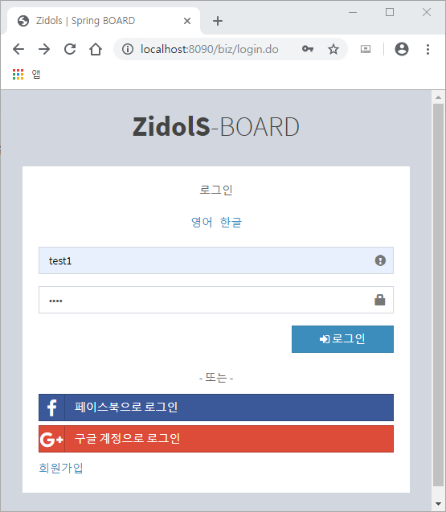
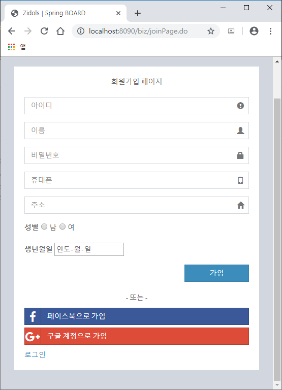
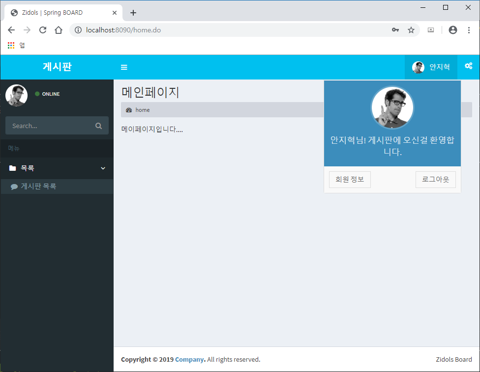
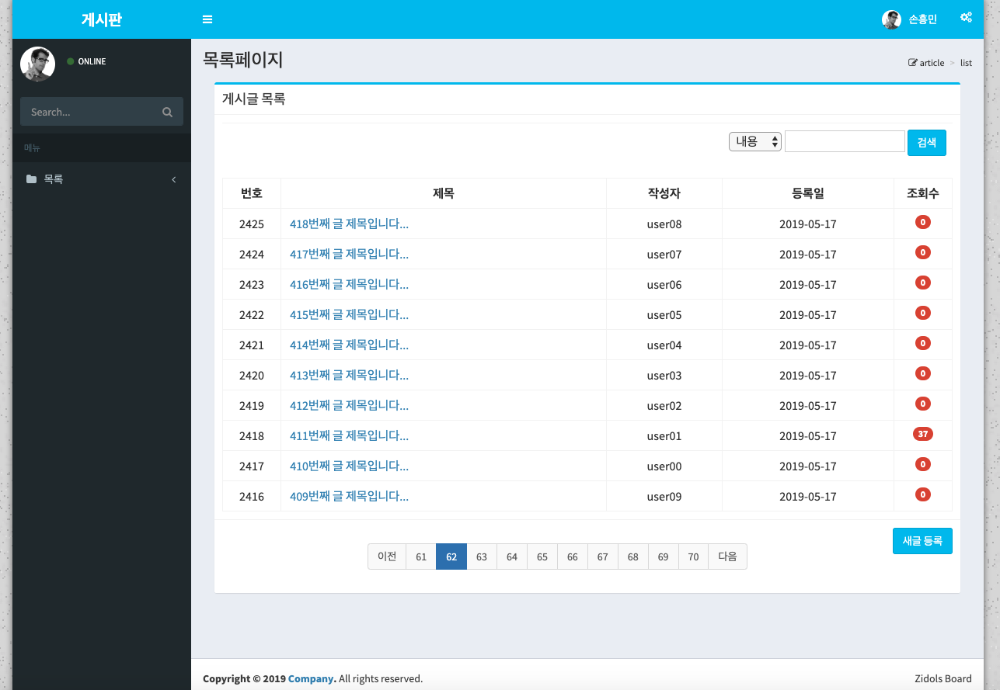
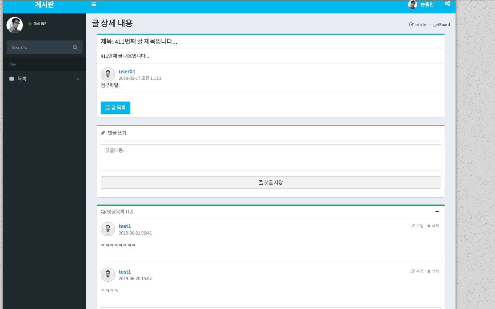

# SpringMybatisBoard

<h1> 스프링 MVC 게시판</h1>
<ul>
  <li><h3>작업기간 : (15일) </h3></li>
  <li><h3>작업인원 : 단독작업</h3></li>
  <li><h3>작업 툴 : STS(Eclipse), Apache Tomcat-9.0.16, Oracle, sqldeveloper, Docker, GitHub</h3></li>
  <li><h3>부트 스트랩 : <a href="https://adminlte.io/">AdminLTE Bootstrap</a>사용</h3></li>
  <li><h3>작품소개 : Spring MVC 패턴의 게시판 프로젝트</h3></li>
  <li><h3>상세 설명 : <a href="https://github.com/zidol/SpringMybatisBoard/blob/master/SpringBoardProject.pdf">SpringBoardProject.pdf</a></h3></li>
</ul>
  <h4>로그인</h4>
  
  <h4>화원가입</h4>
  
  <h4>홈 화면</h4>
  
  <h4>리스트</h4>
  
  <h4>상세 글</h4>
  
